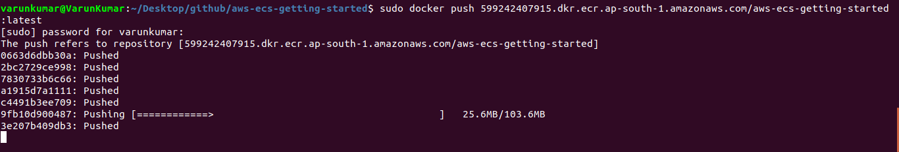

# aws-ecs-getting-started
Getting started with AWS ECS | Deployment in production

## Prerequisite

1. [Install aws CLI](https://docs.aws.amazon.com/cli/latest/userguide/install-cliv2.html)
2. [Install docker](https://docs.docker.com/engine/install/)
3. [Configure aws cli](https://docs.aws.amazon.com/cli/latest/userguide/cli-configure-quickstart.html): `aws configure`


## ECR

### Building docker image

1. Clone the repository `git clone https://github.com/varunon9/aws-ecs-getting-started.git`
2. Move to project `cd aws-ecs-getting-started`
3. Build docker image `docker build -t aws-ecs-getting-started .`
4. Verify that image has been successfully created `docker images --filter reference=aws-ecs-getting-started`
5. Verify that you can run it `docker run -t -i -p 3000:3000 aws-ecs-getting-started` and visiting http://localhost:3000/


### Authenticating docker to Amazon ECR registry

1. Make sure that your IAM user has ECR access (AmazonEC2ContainerRegistry* policy)
2. `aws ecr get-login-password --region <region> | docker login --username AWS --password-stdin <aws_account_id>.dkr.ecr.<region>.amazonaws.com`
3. In above command replace `<region>` with your aws region e.g. ap-south-1 and replace `<aws_account_id>` with your AWS account ID.
4. You can find your AWS account ID from `consoleLoginLink` field of your aws IAM credentials. Visit [this](https://docs.aws.amazon.com/AmazonECR/latest/userguide/get-set-up-for-amazon-ecr.html) for more details.  

### Creating ECR repository (only one time)

```
aws ecr create-repository \
    --repository-name aws-ecs-getting-started \
    --image-scanning-configuration scanOnPush=true \
    --region <region>
```

In above command replace `<region>` with your aws region. This can also be done manually from [ECR console](https://ap-south-1.console.aws.amazon.com/ecr/home).
Do note that for above command to work, your IAM user must have write access to ECR. 

### Pushing image to ECR

1. Tag the image `docker tag aws-ecs-getting-started:latest <aws_account_id>.dkr.ecr.<region>.amazonaws.com/aws-ecs-getting-started:latest`
2. Push the image `docker push <aws_account_id>.dkr.ecr.<region>.amazonaws.com/aws-ecs-getting-started:latest`
3. Check [docs](https://docs.aws.amazon.com/AmazonECR/latest/userguide/getting-started-cli.html) for full reference



## ECS

### Creating Cluster

1. Make sure that your IAM user has ECS access (AmazonECS* policy)
2. `aws ecs create-cluster --cluster-name fargate-cluster`


### Register a Task Definition

1. Visit [Cloudwatch console](https://ap-south-1.console.aws.amazon.com/cloudwatch/home) and create a log group `awslogs-getting-started`.
2. Edit `fargate-task.json` file and replace all occurence of `<aws_account_id>` with your AWS account ID and `<region>` with your aws region
3. `aws ecs register-task-definition --cli-input-json file:///home/varunkumar/Desktop/github/aws-ecs-getting-started/fargate-task.json`
4. Do note that in above command , I have specified full path of fargate-task.json file
5. Once task definition registration is complete, you can use `aws ecs list-task-definitions` to verify


### Creating Service

```
aws ecs create-service \
--cluster fargate-cluster \
--service-name fargate-service \
--task-definition fargate-getting-started:1 \
--desired-count 1 \
--launch-type "FARGATE" \
--network-configuration "awsvpcConfiguration={subnets=[subnet-abcd1234],securityGroups=[sg-abcd1234],assignPublicIp=ENABLED}"
```
2. In above command replace `subnet-abcd1234` with your Subnet ID and `sg-abcd1234` with your Security group ID. Visit [AWS VPC console](https://ap-south-1.console.aws.amazon.com/vpc/home) for details
3. You can verify service creation using `aws ecs list-services --cluster fargate-cluster`


### Describe the Runing Service

1. To get more information `aws ecs describe-services --cluster fargate-cluster --services fargate-service`

### Deploy after changing codebase

1. Rebuild image `docker build -t aws-ecs-getting-started .`
2. Tag it `docker tag aws-ecs-getting-started:latest <aws_account_id>.dkr.ecr.ap-south-1.amazonaws.com/aws-ecs-getting-started:1.1`
3. Push image to ECR `sudo docker push <aws_account_id>.dkr.ecr.ap-south-1.amazonaws.com/aws-ecs-getting-started:1.1`
4. Update task definition `aws ecs register-task-definition --cli-input-json file:///home/varunkumar/Desktop/github/aws-ecs-getting-started/fargate-task.json`
5. List task definitions to get latest revision `aws ecs list-task-definitions`
6. Update service to use new task definition `aws ecs update-service --service fargate-service --task-definition fargate-getting-started:3 --cluster fargate-cluster`

## Cleaning UP

1. Delete the service `aws ecs delete-service --cluster fargate-cluster --service fargate-service --force`
2. Delete the cluster `aws ecs delete-cluster --cluster fargate-cluster`